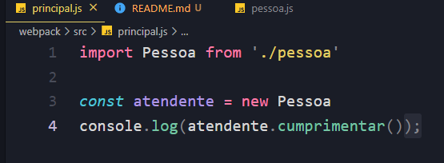
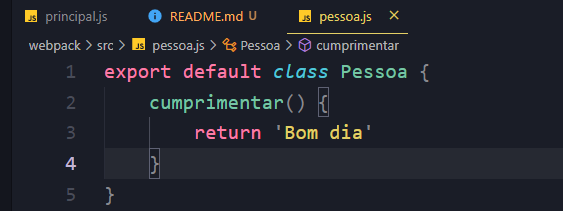
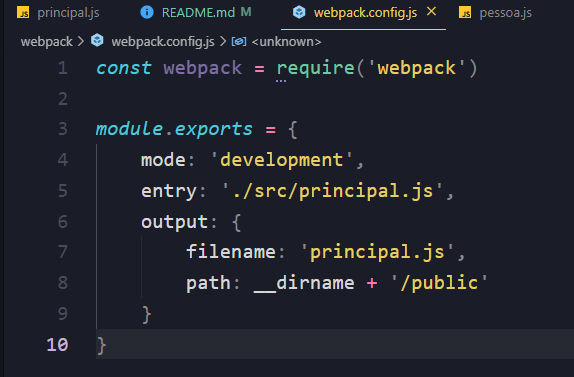

# Códigos do terminal utilizados durante o processo

## Imprimindo na tela com sistemas de módulos
### Programa principal

### Classe Pessoa

### Comando do terminal:
        npm start && node ./dest/main.js

## Configuração do webpack

### Comando do terminal:
       npm start && node public/principal.js 